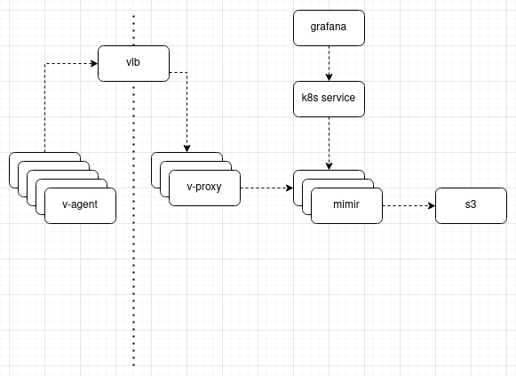

# v-agent

## Overview
`v-agent` is a daemon that gathers metrics and writes them to a `v-proxy`.

`v-proxy` takes a `v-agent` remote write and authenticates it, if it's valid it sends it off to mimir.

### Architecture

`v-agent` must auth with `v-proxy`, this is done passively via headers:
- `X-Vultr-SubID`: Pulled from userdata.
- `X-Vultr-Key`: Pulled from userdata.

`v-proxy` will verify both the headers; once they're verified will write metrics to mimir.

Authentication is passive via headers; if the headers are missing or invalid then request is simply not forwarded.

## Tools
- `v-agent`: Gathers and sends metrics to `v-proxy`.
- `v-proxy`: Receives metrics from `v-agent` and sends to mimir.

### `v-agent`
`v-agent` is a prometheus compatible remote write client.

All metrics that are specifically created with `v-agent` are prefixed with `v_`. Scraped metrics are not modified other than the addition of labels.

Every metric will have the following labels added if they do not exist already:
- `product`: Such as `vke`, `vlb`, `vfs`. This is set in `config.yaml`
- `hostname`: Pulled automatically.
- `subid`: The subscription ID for the underlying service. Can be set in `config.yaml`. If it's not set an attempt is made to pull it from metadata API.
- `vpsid`: The VPS ID. Can be set in `config.yaml`. If it's not set an attempt is made to pull it from the metadata API.

The above labels are added to ensure that the metric is unique within mimir. A lack of uniqueness can result in metrics getting overwritten/clobbered.

System metrics that are collected:
- CPU utilization: system, user, steal, utilization, etc.
- Memory utilization: cached, buffered, utilization, etc.
- Load average: 1, 5, 15, and tasks
- Disk stats: writes/reads, etc.
- Filesystem stats: bytes, inodes, utilization
- NIC: bytes, packets, errors, etc.

Kubernetes:
- `v_kube_apiserver_healthy` that is `0` (if healthy) or `1` if not healthy based on response from kube-apiserver `/healthz` endpoint.
- Every metric from `/metrics`

Etcd:
- `v_etcd_healthy` that is `0` (if healthy) or `1` if not healthy based on response from etcd `/health` endpoint.
- Every metric from `/metrics`

Konnectivty:
- `v_konnectivity_healthy` that is `0` (if healthy) or `1` if not healthy based on response from konnectivity `/healthz` endpoint.
- Every metric from `/metrics`

HAProxy:
- `v_haproxy_healthy` that is `0` (if healthy) or `1` if not healthy based on response from `/metrics` endpoint.
- Every metric from `/metrics`

Ganesha:
- `v_ganesha_healthy` that is `0` (if healthy) or `1` if not healthy based on response from `/metrics` endpoint.
- Every metric from `/metrics`

Ceph:
- `v_ceph_healthy`: Not implemented yet.
- Every metric from `/metrics`

## Configuration
Both have a `config.yaml` file. Both have CLI switches. Both configurations can be overridden with envionment variables.

## Building
Note: Agent must be built with cgo disabled, not doing so will result in GLIBC errors being thrown: `CGO_ENABLED=0 go build -o v-agent cmd/v-agent/main.go`
